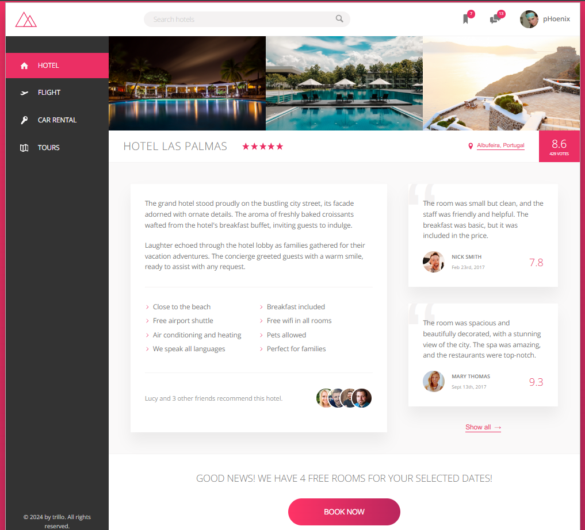
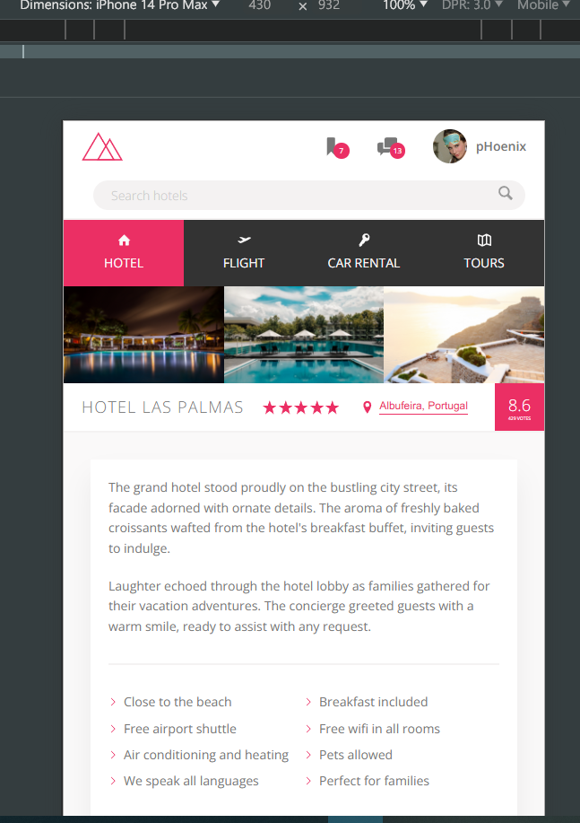

  

# Project Title

This project is based on Jonas Schmedtmann's [ADVANCED HTML-CSS & SASS(SCSS)](https://www.udemy.com/user/jonasschmedtmann/) course. You should check his course. All the credits go to my beautiful teacher Jonas Schmedtmann--

## Trillo-responsive-project---CSS-FLEXBOX

✅[View demo](https://ph0enix46.github.io/Trillo-responsive-project---CSS-FLEXBOX/) 🐛[Bug report](https://github.com/pH0enix46/Trillo-responsive-project---CSS-FLEXBOX/issues)


## About
Nothing just me and my teacher [Jonas Schmedtmann](https://github.com/jonasschmedtmann) have fun with CSS GRID😄

Anyways this project is based on advanced CSS FLEXBOX💪

### Screenshots



## Installation

Clone the repo
```
https://github.com/pH0enix46/Trillo-responsive-project---CSS-FLEXBOX.git
```
install
```
npm install
```

✅Enjoy! for learning 

❌But don't copy
## Acknowledgments
My lovely teacher [Jonas Schmedtmann](https://github.com/jonasschmedtmann)


```
Have a nice Day!😸
```
